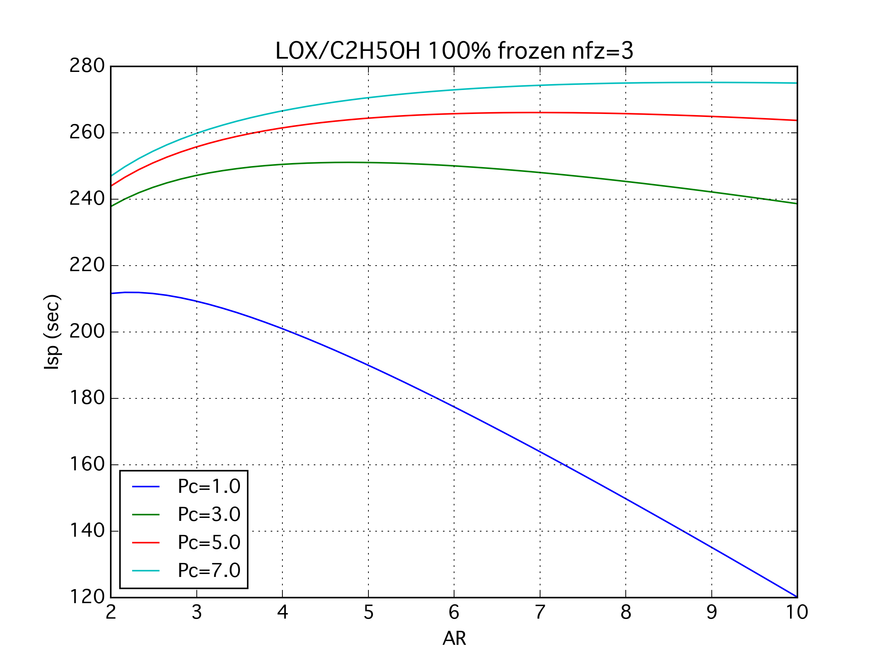

# CEA4py
NASA CEAをpythonの関数として扱うスクリプト．ベースにしているのは
「NASA CEAをMac OSXで実行」 by ina111
http://qiita.com/ina111/items/f5c4eb35a848fdca04b8

実装はまだfac(有限体積燃焼室)に特化したcea_fac()関数だけ．ノズルスロート以降でfrozenの仮定．
Win / Darwin のシステムで動くはず．

公開した主な目的は自分では気付けない間違いを知ることなので，完全動作は保証しません．コメントも全く不足している．

###oringinal author: ina111

###Aug 27 2015 updated by rkanai
 - CEAのinputファイル作成部を汎用性が高いものに変更
 - CEAの出力を使って，適正でない膨張の時の補正を計算するようにした
 - iacとfacで関数を分離

##実装済み関数
###def cea_fac (OF, Pc, AR, CR, Pa = 0.101325):
 - エンジンの諸値から燃焼時の理論値を得る
 - AR = Area Ratio (A_exit / A_throat)
 - CR = Contraction Ratio (A_chamber / A_throat)
 - Pa = Pressure of ambient
 - 返り値はリスト [Pc, OF, isp, ivac, AR, cf]
 - 圧力の単位はMPaA，Ispの単位はsec，あとは無次元
 - fac(有限体積燃焼室)を仮定しているのでCRが引数に含まれる
こういう画が出せる

##実装予定
###def cea_iac (OF, Pc, AR, Pa = 0.101325):
 - エンジンの諸値から燃焼時の理論値を得る
 - iac(無限体積燃焼室)を仮定しているのでCRは考慮しない
 - 他は cea_fac と同じ

##実装したい
###def cea_optexp_iac (OF, Pc, Pa = 0.101325)
 - あるO/FとPcにおける，最適膨張の開口比とその時の理論値を得る
 - 出口大気圧はデフォルト1atmを想定しているが，引数で変更可能
 - 返り値はリスト [isp, ivac, cf, aeat]
